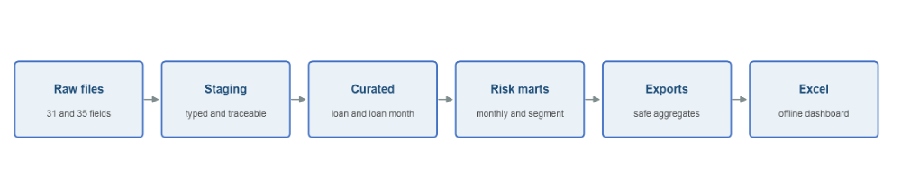
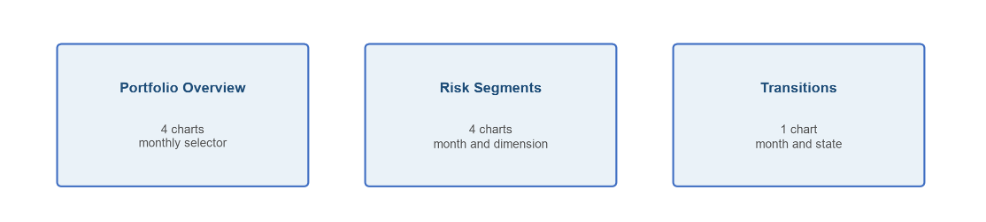

# Mortgage Portfolio Risk Monitoring with SQL and Excel

This project uses Freddie Mac 2019 and 2020 sample mortgage data to build monthly portfolio-risk metrics in DuckDB and an Excel dashboard.

I track on-book balances, 30+/60+/90+ delinquency by loan count and unpaid principal balance (UPB), compare risk across FICO, CLTV, DTI and origination-vintage groups, and calculate month-to-month delinquency transitions. Python runs the SQL steps, exports aggregate data and creates the workbook with XlsxWriter.

## Project at a glance

| Item | Local build |
|---|---:|
| Sampled originations | 100,000 |
| Monthly performance records | 4,452,471 |
| Origination vintages | 2019 and 2020 |
| Performance history | 2019-01 through 2026-03 |
| Analytical loan-month key | `(loan_id, as_of_month)` |
| Main tools | DuckDB, SQL, Python, Excel |

The year labels refer to origination vintages, not the end of each loan's performance history. Both samples continue into later observation years. Core validation checks passed on the local build.

## Questions I wanted to answer

- How many loans and how much UPB remain on book each month?
- How different are delinquency rates when I weight every loan equally versus weighting by balance?
- Which FICO, CLTV, DTI and vintage groups show higher delinquency?
- How do observable loans move between current, delinquent and terminal states from one month to the next?

## Dataset and scope

The input is the Freddie Mac Single-Family Loan-Level Dataset Standard Dataset sample for the 2019 and 2020 origination vintages. I use the origination files for borrower and loan attributes and the monthly performance files for balances, delinquency status, loan age and terminal events.

The project does not include raw Freddie Mac data or generated loan-level artifacts. Users need to obtain the four sample files directly from Freddie Mac and follow the terms that apply to their access. See [NOTICE.md](NOTICE.md) for the repository's data-publication boundary.

## Portfolio and delinquency definitions

A monthly record is **on book** when Current Actual UPB is positive and Zero Balance Code is blank. A zero-balance terminal record remains available for transition analysis but is not included in month-end exposure.

The **delinquency-eligible** population is narrower. It includes on-book records with Loan Age of at least 1 and a numeric Current Loan Delinquency Status from `00` through `99`. Loan Age 0, `RA`, `XX`, missing or invalid statuses and terminal rows do not enter the delinquency denominator. The dashboard shows eligible coverage against the broader on-book population so this difference is visible.

The delinquency thresholds are:

- 30+: numeric status of `01` or higher
- 60+: numeric status of `02` or higher
- 90+: numeric status of `03` or higher

For each threshold, I calculate both a count rate and a UPB-weighted rate. Count rates divide delinquent loans by eligible loans. UPB-weighted rates divide delinquent UPB by eligible UPB. These measures can differ when larger-balance loans perform differently from smaller-balance loans.

The 90+ bucket measures severe delinquency. I do not label every 90+ loan as default because a default definition would need a separate event rule, such as a selected zero-balance, disposition or REO outcome.

## Risk segmentation

The monthly segment table contains four independent views:

- origination vintage: 2019 and 2020
- Classic FICO: `<620`, `620-659`, `660-699`, `700-739`, `740-779`, `780+`, `Unknown`
- Original CLTV: `<=60`, `61-70`, `71-80`, `81-90`, `91-95`, `>95`, `Unknown`
- Original DTI: `<=20`, `21-30`, `31-40`, `41-45`, `46-50`, `>50`, `Unknown`

Each row keeps additive exposure, denominator and delinquency numerator fields. Excel recalculates the displayed rates from those components rather than averaging stored percentages. Missing values and documented Freddie Mac sentinels remain in `Unknown`; they are not moved into the highest-risk band.

## Monthly transitions

The transition analysis joins a loan's current observation only to the same loan exactly one calendar month later. It does not treat the next available record after a gap as a monthly transition.

The beginning observation must be on book. The destination can be current, 30, 60, 90+, REO, unknown or a terminal state. The count rate uses observable loans in the same beginning-month and from-state cohort. The balance rate uses their beginning-month UPB. A final record without the next calendar month is right-censored and excluded from the transition denominator.

## Workflow



```text
four raw sample files
        ↓
DuckDB staging and loan-month tables
        ↓
monthly portfolio, segment and transition metrics
        ↓
three aggregate CSV exports
        ↓
Excel dashboard
```

The SQL steps run in one DuckDB transaction so a failed validation does not leave a partial database. The schemas are `raw_external`, `staging`, `curated`, `mart` and `quality`; their names describe the role of each table without adding another framework.

## Excel dashboard

The workbook contains three user-facing pages:

- **Portfolio Overview** for monthly exposure, eligibility coverage and count- and UPB-based delinquency trends
- **Risk Segments** for a selected month and segmentation dimension
- **Transitions** for count and beginning-UPB migration matrices and a selected origin-state chart



The workbook also includes three aggregate data sheets and a short ReadMe sheet. It uses native Excel formulas, charts and dropdowns. No loan identifiers or loan-level rows are written to the workbook.

## Data checks

I kept checks that would materially change the analysis if they failed: source row counts, duplicate keys, origination/performance coverage, valid dates and major status codes, on-book and eligible population logic, delinquency numerator hierarchy, segment reconciliation, three lower-level metric recalculations, adjacent-month transition pairs, and transition cohort/rate reconciliation.

The raw-data script separately checks that all four files exist, have the expected field counts and row counts, and contain usable dates, numeric fields and status codes. The export script performs a smaller set of checks for output row counts, key uniqueness, aggregate reconciliation and the absence of loan identifier columns.

## Repository structure

```text
.
├── README.md
├── NOTICE.md
├── requirements.txt
├── docs/
│   └── project_notes.md
├── scripts/
│   ├── validate_raw_data.py
│   ├── build_data_layer.py
│   ├── export_dashboard_data.py
│   └── build_excel_dashboard.py
└── sql/
    ├── 00_init.sql
    ├── 10_staging.sql
    ├── 20_curated.sql
    ├── 30_marts.sql
    ├── 40_dashboard_exports.sql
    └── 90_validation_checks.sql
```

The main metric definitions are in `sql/20_curated.sql` and `sql/30_marts.sql`. Transition pairing is defined in `sql/20_curated.sql`. Additional implementation notes are in [docs/project_notes.md](docs/project_notes.md).

## How to run

Place the downloaded sample files at:

```text
data/raw/sample_2019/sample_orig_2019.txt
data/raw/sample_2019/sample_perf_2019.txt
data/raw/sample_2020/sample_orig_2020.txt
data/raw/sample_2020/sample_perf_2020.txt
```

Then run:

```bash
python3 -m venv .venv
.venv/bin/python -m pip install -r requirements.txt
.venv/bin/python scripts/validate_raw_data.py
.venv/bin/python scripts/build_data_layer.py
.venv/bin/python scripts/build_excel_dashboard.py
```

The final command refreshes the aggregate CSV files before creating `outputs/mortgage_portfolio_risk_monitoring_sql_excel_dashboard.xlsx`.

## Limitations

This is a descriptive portfolio-monitoring project, not a predictive credit model. It uses two annual samples rather than Freddie Mac's full loan population or a live lender portfolio. Trends reflect different entry timing, seasoning, payoff and other exits, right-censoring, and changes in the loans remaining in the sample. The Excel dashboard is based on local aggregate outputs and does not refresh from an external connection.

Official references: [Freddie Mac Single-Family Loan-Level Dataset](https://www.freddiemac.com/research/datasets/sf-loanlevel-dataset), [Release 47 General User Guide](https://www.freddiemac.com/fmac-resources/research/pdf/general_user_guide_july_2026.pdf), and [Release 47 File Layout](https://www.freddiemac.com/fmac-resources/research/pdf/file_layout_july_2026.xlsx).
